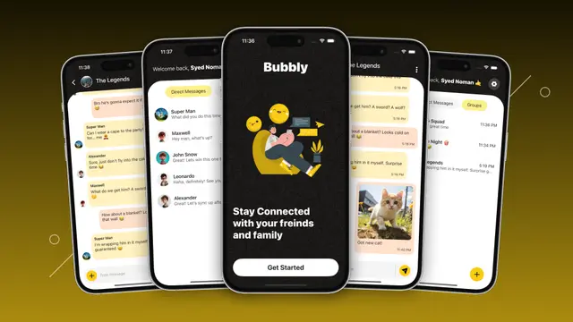

<div align="center">
 <br /> 
   <a href="https://github.com/Itssanthoshhere/Bubbly-ChatApp" target="_blank">
    
  </a> 
  <div>
    
    
    
    
    
  </div>
  <div>
    
    
    
    
    
  </div>

  <h3>💬 Bubbly ChatApp – Real-Time Messaging with Expo & Node.js</h3>
  <b>A full-stack, real-time chat application</b> built using <b>React Native (Expo)</b> on the frontend and <b>Node.js + Express + MongoDB</b> on the backend.<br/>
  Features secure authentication, rich UI components, and real-time conversation updates powered by <b>Socket.IO</b>.
  <br/><br/>
  <i>Designed for fast, reliable, and scalable mobile messaging experiences.</i>
  <br/><br/>
</div>

---

## 📋 Table of Contents

- [📋 Table of Contents](#-table-of-contents)
- [✨ Introduction](#-introduction)
- [⚙️ Tech Stack](#️-tech-stack)
  - [💻 Backend](#-backend)
  - [📱 Frontend (Expo)](#-frontend-expo)
- [🔋 Core Features](#-core-features)
  - [⚙️ Backend](#️-backend)
  - [📱 Frontend (Expo)](#-frontend-expo-1)
- [🤸 Quick Start](#-quick-start)
  - [Prerequisites](#prerequisites)
  - [1️⃣ Clone Repository](#1️⃣-clone-repository)
  - [2️⃣ Setup Backend](#2️⃣-setup-backend)
  - [3️⃣ Setup Frontend (Expo)](#3️⃣-setup-frontend-expo)
- [🧱 Project Structure](#-project-structure)
  - [🖥️ Backend](#️-backend-1)
  - [📱 Frontend (Expo)](#-frontend-expo-2)
- [🧠 Architecture Overview](#-architecture-overview)
    - [**Backend (Server)**](#backend-server)
    - [**Frontend (Mobile App)**](#frontend-mobile-app)
- [🚀 Future Enhancements](#-future-enhancements)
- [🤝 Contribution](#-contribution)
- [🔗 Contacts](#-contacts)
- [📄 License](#-license)
- [🙏 Acknowledgements](#-acknowledgements)
  - [⭐ Show Your Support](#-show-your-support)

---

## ✨ Introduction

**Bubbly ChatApp** is a **modern full-stack real-time messaging app** inspired by platforms like WhatsApp and Messenger.

Built with **React Native (Expo)** on the frontend and **Node.js + Express + TypeScript** on the backend, it delivers:

- Secure user authentication
- Live chat via **Socket.IO**
- Clean UI built with **NativeWind (TailwindCSS for React Native)**
- Scalable backend using **MongoDB**

---

## ⚙️ Tech Stack

### 💻 Backend

- **Node.js** – JavaScript runtime for server logic
- **Express.js** – Web framework for APIs
- **TypeScript** – Type-safe backend development
- **MongoDB + Mongoose** – Database for storing users, messages, and conversations
- **Socket.IO** – Real-time bi-directional event-based communication
- **JWT** – Authentication via tokens
- **Multer** – File uploads (user avatars)

### 📱 Frontend (Expo)

- **React Native (Expo)** – Cross-platform mobile development
- **TypeScript** – Strongly-typed mobile code
- **Expo Router / React Navigation** – Screen and route management
- **NativeWind + TailwindCSS** – Utility-first styling
- **Axios** – HTTP requests
- **Socket.IO Client** – Real-time message syncing

---

## 🔋 Core Features

### ⚙️ Backend

✅ User registration and login via **JWT**  
✅ Secure password storage and validation  
✅ Real-time communication setup via **Socket.IO**  
✅ Message storage in **MongoDB**  
✅ User presence and typing indicators  
✅ Scalable REST API architecture

### 📱 Frontend (Expo)

✅ Authentication screens (Login, Register, Welcome)  
✅ Real-time chat UI with message streaming  
✅ Profile management and image uploads  
✅ Reusable UI components (Buttons, Avatars, Headers)  
✅ Context API for global authentication state  
✅ Clean UI using **NativeWind (TailwindCSS)**

---

## 🤸 Quick Start

### Prerequisites

Ensure the following are installed:

- Node.js (v18+)
- npm or yarn
- MongoDB (local or cloud)
- Expo CLI (`npm install -g expo-cli`)

### 1️⃣ Clone Repository

```bash
git clone https://github.com/Itssanthoshhere/Bubbly-ChatApp.git
cd Bubbly-ChatApp
```

### 2️⃣ Setup Backend

```bash
cd backend
npm install
npm run dev
```

> Update your `.env` file with database credentials and JWT secret.

### 3️⃣ Setup Frontend (Expo)

```bash
cd frontend
npm install
npx expo start
```

Scan the QR code with the **Expo Go app** to preview the app.

---

## 🧱 Project Structure

### 🖥️ Backend

```
backend/
├── config/
│   └── db.ts
├── controllers/
│   └── auth.controllers.ts
├── models/
│   ├── Conversation.ts
│   ├── Message.ts
│   └── User.ts
├── routes/
│   └── auth.routes.ts
├── socket/
│   ├── chatEvents.ts
│   ├── userEvents.ts
│   └── socket.ts
├── utils/
│   └── token.ts
├── index.ts
└── types.ts
```

### 📱 Frontend (Expo)

```
frontend/
├── app/
│   ├── (auth)/
│   ├── (main)/
│   ├── _layout.tsx
│   └── index.tsx
├── components/
│   ├── Avatar.tsx
│   ├── Button.tsx
│   ├── ConversationItem.tsx
│   ├── MessageItem.tsx
│   ├── ScreenWrapper.tsx
│   └── Typo.tsx
├── constants/
│   ├── theme.ts
│   └── index.ts
├── contexts/
│   └── authContext.tsx
├── services/
│   ├── authService.ts
│   └── imageService.ts
├── socket/
│   ├── socket.ts
│   └── socketEvents.ts
└── utils/
    └── styling.ts
```

---

## 🧠 Architecture Overview

#### **Backend (Server)**

- **Express.js** API for user and message management
- **Mongoose** models: User, Message, Conversation
- **Socket.IO** enables live communication
- **JWT** for token-based authentication
- **Token utilities** in `utils/token.ts`
- **Database connection** managed in `config/db.ts`

#### **Frontend (Mobile App)**

- **Expo + TypeScript** for modular and maintainable development
- **Context API** for managing authentication state
- **Socket.IO Client** handles live message updates
- **NativeWind (Tailwind)** ensures consistent styling
- **Component-based design** for reusability and readability

---

## 🚀 Future Enhancements

- Push notifications for new messages
- End-to-end encryption
- Message reactions and read receipts

---

## 🤝 Contribution

Contributions, issues, and feature requests are welcome!
Feel free to fork this repository and submit pull requests.

---


## 🔗 Contacts

- **GitHub:** [Itssanthoshhere](https://github.com/Itssanthoshhere)
- **LinkedIn:** [Santhosh VS](https://www.linkedin.com/in/thesanthoshvs/)

---

## 📄 License

For **educational and portfolio purposes only**.
All images, logos, and assets belong to their respective owners.

---

## 🙏 Acknowledgements

Special thanks to:

- **Expo** for simplifying mobile development
- **Socket.IO** for enabling real-time communication
- **MongoDB & Mongoose** for powerful data handling
- **NativeWind** for expressive styling in React Native

---

### ⭐ Show Your Support

If you like this project, give it a **⭐ on GitHub** — it helps others discover it!

---
